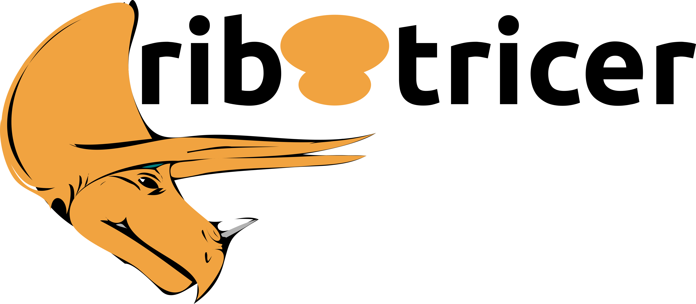

# ribotricer: Accurate detection of short and long active ORFs using Ribo-seq data

[](https://travis-ci.org/smithlabcode/ribotricer)
[](https://pypi.org/project/ribotricer/)
[](http://bioconda.github.io/recipes/ribotricer/README.html)

[](https://pypi.org/project/ribotricer/)
[](https://anaconda.org/bioconda/ribotricer)
[](LICENSE)

[Online Paper](https://academic.oup.com/bioinformatics/advance-article-abstract/doi/10.1093/bioinformatics/btz878/5637228) | [PDF](https://saket-choudhary.me/pdfs/ribotricer_2019.pdf) | [Supplementary File](https://saket-choudhary.me/pdfs/ribotricer_2019.pdf) | [Benchmarking scripts](https://github.com/smithlabcode/ribotricer-results/)


## Installation

We highly recommend that you install ribotricer via [conda](https://docs.conda.io/projects/conda/en/latest/user-guide/install/) in a clean environment: 

```bash
conda create -n ribotricer_env -c bioconda ribotricer
conda activate ribotricer_env
ribotricer --help
```

To install locally, you can either download the source code from release or clone the latest version using ```git clone```.
After you get a copy of the source code, please change into the source directory and run:

```bash
make install
```

**NOTE**: ribotricer will install the following dependencies (If some of these are already present, they might be replaced by the designated version): 

```
pyfaidx>=0.5.0
pysam>=0.11.2.2
numpy>=1.11.0
pandas>=0.20.3
scipy>=0.19.1
matplotlib>=2.1.0
click>=6.0
click-help-colors>=0.3
quicksect>=0.2.0
tqdm>=4.23.4
```


------------------

## Workflow of ribotricer

In order to run ribotricer, you need to have the following three files
prepared including:

* **genome annotation file** in GTF format: our implementation handles
all variations of GTFs besides the often used GENCODE and Ensembl hosted ones
* **reference genome file** in FASTA format
* **alignment file** in BAM format

### Preparing candidate ORFs

The first step of ribotricer is to take the GTF file and the FASTA file to find all
candidate ORFs. In order to generate all candidate ORFs, please run

```bash
ribotricer prepare-orfs --gtf {GTF} --fasta {FASTA} --prefix {RIBOTRICER_INDEX_PREFIX}
```

The command above by default only includes ORFs with length longer than 60 nts,
and only uses 'ATG' as start codon. You can change the setting by including
options ```--min_orf_length``` and ```--start_codons```. 

Output: {PREFIX}\_candidate\_orfs.tsv.

### Detecting translating ORFs

The second step of ribotricer is to take the index file generated by ```prepare-orfs```
and the BAM file to detect the actively translating ORFs by assessing the periodicity
of all candidate ORFs:

```bash
ribotricer detect-orfs \
             --bam {BAM} \
             --ribotricer_index {RIBOTRICER_INDEX_PREFIX}_candidate_ORFs.tsv \
             --prefix {OUTPUT_PREFIX}
```

**NOTE**: This above command, by default, uses a phase-score cutoff of 0.428. Our species specific recommended cutoffs
are as follows:


|Species      | Cutoff| 
|-------------|-------|
|Arabidopsis  | 0.330 |
|C. elegans   | 0.239 |
|Baker's Yeast| 0.318 |
|Drosophila   | 0.181 |
|Human        | 0.440 |
|Mouse        | 0.418 |
|Rat          | 0.453 |
|Zebrafish    | 0.249 |

In order to assign `non-translating` or `translating` status, ribotricer by default
uses a cutoff threshold of `0.428`. ORFs with phase score above `0.428` are marked as 
translating as long as they have at least five codons with non-zero read count.
By default, ribotricer does not take coverage into account for predicting an ORF to be
translating or not-translating. However, this behavior can be changed by following 
filters:

- `--min_valid_codons` (default=5): Minimum number of codons with non-zero reads for determining active translation
- `--min_valid_codons_ratio` (default=0): Minimum ratio of codons with non-zero reads to total codons for determining active translation
- `--min_reads_per_codon` (default=0): Minimum number of reads per codon for determining active translation
- `--min_read_density` (default=0.0): Minimum read density (total_reads/length) over an ORF total codons for determining active translation

For each of the above filters, an ORF failing **any** of the filters is 
marked as `non-translating`.

For example, to ensure that each ORF has at least 3/4 of its codons non-empty,
we can specify `--min_valid_codons_ratio` to be 0.75:

```

ribotricer detect-orfs \
             --bam {BAM} \
             --ribotricer_index {RIBOTRICER_INDEX_PREFIX}_candidate_ORFs.tsv \
             --prefix {OUTPUT_PREFIX}
             --min_valid_codons_ratio 0.75
```

The ORF detection step consists of several small steps including:

1. Infer the experimental protocol (strandedness of the reads)  
You can directly assign the strandedness using option ```--stranded```, it can be 'yes',
'no', or 'reverse'. If this option is not provided, ribotricer will automatically infer the
experimental protocol by comparing the strand of reads to the reference.   

Output: {OUTPUT_PREFIX}\_protocol.txt

2. Split the bam file by strand and read length  
In this step, all mapped reads will be filtered to include only uniquely mapped reads. Reads
will be split by strand and read length with respect to the strandedness provided or inferred
from the previous step. If you only want to include certain read lengths, they can be assigned with
option ```--read_lengths```.  
Output: {OUTPUT_PREFIX}\_bam\_summary.txt

3. Plot read length distribution  
In this step, read length distribution will be plotted and serves as quality control  
Output: {OUTPUT_PREFIX}\_read\_length\_dist.pdf

4. Calculate metagene profiles  
In this step, the metagene profile of all CDS transcripts for each read length is
calculated by aligning with start codon or stop codon.  
Output: {OUTPUT_PREFIX}\_metagene\_profiles\_5p.tsv is the metagene profile aligning with the
start codon and {OUTPUT_PREFIX}\_metagene\_profiles\_3p.tsv is the metagene profile aligning with
the stop codon

5. Plot metagene profiles  
In this step, metagene plots will be made to serve as quality control.  
Output: {OUTPUT_PREFIX}\_metagene\_plots.pdf

6. Align metagene profiles  
If the P-site offsets are not provided, this step will use cross-correlation to find out the relative
offsets between different read lengths  
Output: {OUTPUT_PREFIX}\_psite\_offsets.txt

7. merge reads from different read lengths based on P-site offsets  
This step will integrate reads of different read lengths by shifting with the P-site offsets

8. Export wig file  
A WIG file is exported in this step to be used for visualization in Genome Browser  
Output: {OUTPUT_PREFIX}\_pos.wig for the positive strand and {OUTPUT_PREFIX}\_neg.wig for the negative strand.

9. Export actively translating ORFs  
The periodicity of all ORF profiles are assessed and the translating ones are outputed. You can output all ORFs regardless
of the translation status with option ```--report_all```  
Output: {OUTPUT_PREFIX}\_translating\_ORFs.tsv

------------------

## Definition of ORF types
Ribotricer reports eight different ORF types as defined below:
* **annotated**: CDS annotated in the provided GTF file
* **super_uORF**: upstream ORF of the annotated CDS, not overlapping with any CDS of the same gene (first or most upstream uORF)
* **super_dORF**: downstream ORF of the annotated CDS, not overlapping with any CDS of the same gene  (last or most downstream dORF)
* **uORF**: upstream ORF of the annotated CDS, not overlapping with the main CDS
* **dORF**: downstream ORF of the annotated CDS, not overlapping with the main CDS
* **overlap_uORF**: upstream ORF of the annotated CDS, overlapping with the main CDS
* **overlap_dORF**: downstream ORF of the annotated CDS, overlapping with the main CDS
* **novel**: ORF in non-coding genes or in non-coding transcripts of coding genes

------------------

## Learning cutoff empirically from data

Ribotricer can also learn cutoff empirically from the data. Given at least one Ribo-seq and one RNA-seq BAM file,
`ribotricer` learns the cutoff by running one iteration of the algorithm on the provided files with a prespecified
cutoff (`--phase_score_cutoff`, default: 0.428) and then uses the generated output to find the median difference between Ribo-seq and RNA-seq phase scores of only candidate ORFs with `transcript_type` set to `protein_coding` (`--filter_by_tx_annotation`).

```
ribotricer learn-cutoff --ribo_bams ribo_bam1.bam,ribo_bam2.bam \
--rna_bams rna_1.bam \
--prefix ribo_rna_prefix \
--ribotricer_index {RIBOTRICER_ANNOTATION}
```

## Visualizing ribotricer output

Ribotricer generates a de-noised profile of read counts for each ORF. We can visualize the read distribution for any ORF. For an example,
see [this notebook](https://github.com/smithlabcode/ribotricer/blob/master/notebooks/Plotting_ribotricer_profile.ipynb).


------------------

## Contacts and bug reports

https://github.com/smithlabcode/ribotricer/issues

If you found a bug or mistake in this project, we would like to know about it.
Before you send us the bug report though, please check the following:

1. Are you using the latest version? The bug you found may already have been
   fixed.
2. Check that your input is in the correct format and you have selected the
   correct options.
3. Please reduce your input to the smallest possible size that still produces
   the bug; we will need your input data to reproduce the problem, and the
   smaller you can make it, the easier it will be.
   
------------------

## LICENSE

Ribotricer for detecting actively translating ORFs from Ribo-seq data
Copyright (C) 2022 Saket Choudhary, Wenzheng Li, Andrew D Smith, and
the University of Southern California

This program is free software: you can redistribute it and/or modify
it under the terms of the GNU General Public License as published by
the Free Software Foundation, either version 3 of the License, or (at
your option) any later version.

This program is distributed in the hope that it will be useful,
but WITHOUT ANY WARRANTY; without even the implied warranty of
MERCHANTABILITY or FITNESS FOR A PARTICULAR PURPOSE.  See the
GNU General Public License for more details.

You should have received a copy of the GNU General Public License
along with this program.  If not, see <http://www.gnu.org/licenses/>.
