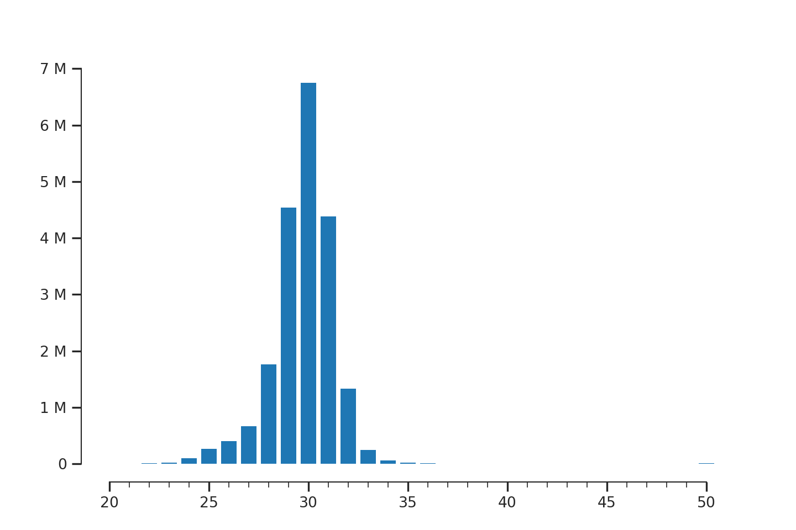
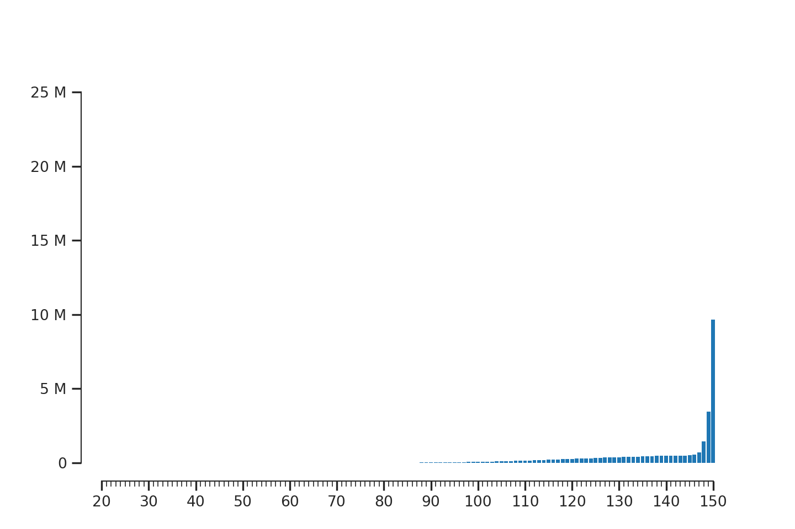

API Usage
=========

.. code-block:: python

   from riboraptor import read_length_distribution
   from riboraptor import fragment_enrichment
   from riboraptor.plotting import  plot_read_counts
   from riboraptor.plotting import plot_fragment_dist

Counting Fragment Lengths
-------------------------

.. code-block:: python

   ribo_bam_f = '../data/U251_ribo.bam'
   fragment_lengths = read_length_distribution(ribo_bam_f)
   ax, fig = plot_fragment_dist(fragment_lengths)

    Fragment length distribution of an Ideal Ribo-seq library

The abosve is a good example of an ideal Ribo-seq library where the fragment
lengths are concentrated between 28 and 31 nucelotides.

We can also "quantify" this enrichment:

.. code-block:: python

   ribo_enrichment = fragment_enrichment(ribo_bam_f)

.. code-block:: python

   print(ribo_enrichment)
   >>> (75.19322097821424, 0.045749574004642399)

Let's compare this with a RNA-Seq sample from the same sample.

.. code-block:: python

   rna_bam_f = '../data/U251_rna.bam'
   fragment_lengths = read_length_distribution(rna_bam_f)
   ax, fig = plot_fragment_dist(fragment_lengths)

    Fragment length distribution of a paired-end RNA-seq library

.. code-block:: python

   rna_enrichment = fragment_enrichment(rnabam_f)
   print(rna_enrichment)
   >>> (2.334333862251336e-05, 1.0)

Gene Coverage
-------------

In order to visualize genewise coverage, we need to create a bigwig file first. This inturn
requires a bedgraph file.

Creating bedgraph
~~~~~~~~~~~~~~~~~

.. code-block:: python

   from riboraptor import create_bedgraph
   create_bedgraph(ribo_bam_f, strand='both', end_type='5prime', outfile='../data/U251_ribo.bg')

Creating bigwig
~~~~~~~~~~~~~~~~~

.. code-block:: python

    from riboraptor import bedgraph_to_bigwig
    bedgraph_f = '../data/U251_ribo.bg'
    chrom_sizes = '../data/hg38.sizes'
    bedgraph_to_bigwig(bedgraph_f, chrom_sizes, '../data/U251_ribo.bw')

Gene coverage plot
~~~~~~~~~~~~~~~~~~

.. code-block:: python

   from riboraptor import gene_coverage
   cds_bed = '../data/hg38.cds.bed'
   bw = '../data/U251_ribo.bw'
   coverage, _, _, _ = gene_coverage('ENSG00000080824', cds_bed, bw, 60)

The last argument 60 here specifies the number of upstream bases to count.
We visualize only the first 100 bases:

.. code-block:: python

    ax, fig, peak = plot_read_counts(coverage[range(-60,100)],
                                     majorticks=10,
                                     minorticks=5,
                                     marker='o',
                                     millify_labels=False)

.. figure:: images/gene_coverage_ENSG00000080824.png
    :align: center
    :width: 100%
    :alt: Gene coverage
    :figclass: align center

    Gene coverage across ENSG00000080824

Periodicity Index
~~~~~~~~~~~~~~~~~

TODO

5'UTR/CDS/3'UTR coverage
~~~~~~~~~~~~~~~~~~~~~~~~

TODO

