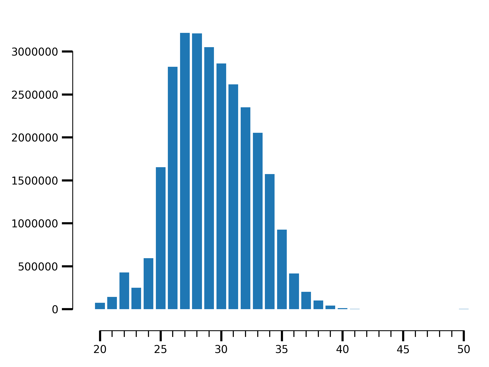
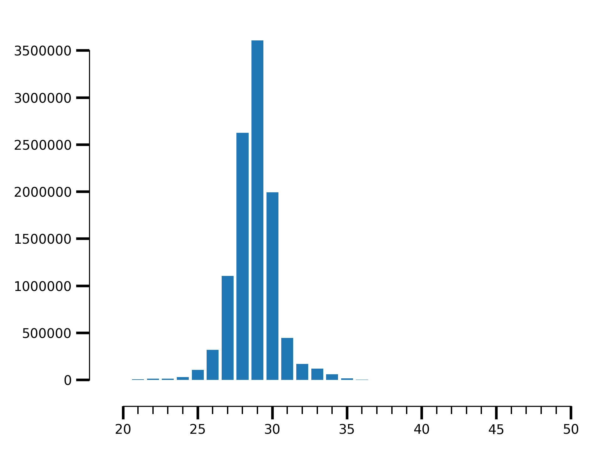

============================================================================
Complete Pipeline
============================================================================

Contents
========
The RiboPipe software package is a comprehensive pipeline and set of tools for
analyzing Ribo-seq sequencing data. This manual explains
the stages in our pipeline, how to use the analysis tools, and how to modify
the pipeline for your specific context.

Assumptions
===========
Our pipeline was designed to run in a cluster computing context, with many
processing nodes available, and a job submission system like PBS or SGE.
Much of this analysis is computationally intensive. We assume that individual
nodes will have several GB of memory available for processing.

Translation profile construction
================================
Ribo-seq experiments are always single-end sequenced. Ribosome protected fragments range
from 28-31 nucleotides and hence most experiments involve 50 bp single end reads. Before mapping,
we need to get rid of the adapters which are ligated at the 3' end of the fragments as part of the
library protocol.

Trimming Reads
--------------
We use trim_galore_ for trimming. It automates adapter trimming:

.. code-block:: console

    $ trim_galore -o <out_dir> -q <min_quality> <input.fq.gz>

-o out_dir        Output directory
-q min_quality    Trim low-quality ends from reads in addition to adapter removal

Mapping Reads
-------------
We use STAR_ to map reads. The first step is to create an index, preferably
using a GTF file. If the index step is run without a GTF file (which is optional), 
STAR_ will not be splice-aware.

Creating Index
~~~~~~~~~~~~~~
.. code-block:: console

    $ STAR --runThreadN <threads>\
          --runMode genomeGenerate\
          --genomeDir <index_out_dir>\
          --genomeSAindexNbases <SA_INDEX_Nbases>\
          --genomeFastaFiles <input.fasta>\
          --sjdbGTFfile <input.gtf>

--runThreadN threads                     Number of threads to use
--runMode genomeGenerate                 Flag to set for index mode
--genomeDir index_out_dir                Directory to write index files to
--genomeSAindexNbases SA_INDEX_Nbases    min(14, log2(GenomeLength)/2 - 1), 
                                         this **must** be scaled down for small genomes
--genomeFastaFiles input_fasta           Path to reference fasta
--sjdbGTFfile input_gtf                  Path to GTf file

Mapping
~~~~~~~
.. code-block:: console

    $ STAR --runThreadN <threads>\
          --genomeDir <input.index>\
          --outFilterMismatchNmax 2\
          --alignIntronMin <ALIGN_INTRON_Nmin>\
          --alignIntronMax <ALIGN_INTRON_Nmax>\
          --outFileNamePrefix <params.prefix> --readFilesIn <input.R1>\
          --outSAMtype BAM Unsorted\
          --readFilesCommand zcat\
          --quantMode TranscriptomeSAM\
          --outTmpDir /tmp/<params.name>_tmp\
          --outReadsUnmapped Fastx\

--runThreadN threads                Number of threads to use
--genomeDir index_out_dir           Path to index directory
--outFilterMismatchNmax mismatches  Allow a maximum of mismatches=2
--alignIntronMin ALIGN_INTRON_Nmin  Minimum intron size. Any genomic gap
                                    is considered intron if its
                                    length >= alignIntronMin.
--alignIntronMax ALIGN_INTRON_Nmax  Maximum intron size
--outFileNamePrefix prefix          Prefix for output files
--readFilesIn input_fq_gz           Path to input fastq.gz
--outSAMtype outtype                Output an unsorted BAM file (outtype=BAM Unsorted)
--readFilesCommand zcat             Since input is gzipped use zcat to
                                    decompress it on the fly
--quantMode TranscriptomeSAM        Also output BAM aligned to the transcriptome
--outTmpDir tpmdir                  Directory to use for writing 
                                    temporary files
--outReadsUnmapped Fastx            Write unmapped reads to separate 
                                    fastq file

Sorting and Indexing
~~~~~~~~~~~~~~~~~~~~
STAR outputted BAM files are not sorted. We need a BAM file sorted
by coordinates.

.. code-block:: console

   $ samtools sort <prefix>Aligned.out.bam -o <output.bam> -T <tmpdir>_sort &&\
   $ samtools index <prefix>Aligned.out.bam

Additionaly, we also need BAM file sorted by name, since htseq-counts_
(and featureCounts_) prefer a BAM sorted by name in their default mode.

.. code-block:: console

   $ samtools sort -on <input.bam> -T <tmpdir> -o <output.bam> &&\
   $ samtools index <output.bam>

Translation profile analysis
============================
Once we have the bams, we are ready for downstream analysis. We will use our riboraptor_ tool 
for all downstream analysis.

Counting uniquely mapped reads
------------------------------
The first step is to simply caculate number of uniquely mapping reads.
We recommend a minimum of 5 million reads for any downstream analysis.

.. code-block:: console

   $ riboraptor uniq-mapping-count --bam <input.bam>

--bam input.bam    Path to bam file

Read length distribution
------------------------
An ideal Ribo-seq library is expected to have 28-31 nt long fragments most enriched.
We can calculate enrichment and plot the fragment size distribution using riboraptor.

Readd length distribution can be calculated using the `read-length-dist` subcommand:

.. code-block:: console

   $ riboraptor read-length-dist --bam <input.bam>

This will print out the read length and associated counts on the console. In order to
visualize thhese counts as a barplot, we can use the `plot-read-dist` subcommand:

.. code-block:: console

   $ riboraptor read-length-dist --bam <input.bam>\
        | riboraptor plot-read-dist --saveto <output.png>

Metagene Analysis
-----------------
A metagene plot is used as a summary statistic to visualize the distribution of ribosome
protected fragments along the positions of a gene often starting (ending) at the start (stop)
codon. This is useful for estimating P-site offsets. The ribosome subunuits are known to protect
28-32 nt and hence the P-site is often located 12 nt downstream the 5' position of the mapped read.

Creating bigWig file
~~~~~~~~~~~~~~~~~~~~~
To perform metagene analysis, we will work with bigWig_ format. in order to do that, we need an 
intermediate bedGraph_ file. This can be done using `bam-to-bedgraph` subcommand:

.. code-block:: console

   $ riboraptor bam-to-bedgraph --bam <input.bam> 

This will print the bedGraph to console. this cna be piped to `bedgraph-to-bigwig` subcommand:

.. code-block:: console

   $ riboraptor bam-to-bedgraph --bam <input.bam> \
        | riboraptor bedgraph-to-bigwig --sizes <genome.sizes> --saveto <output.bw>

We now have `<output.bw>` ready for further downstream analysis.

Distribution in 5'UTR/3'UTR/CDS regions
~~~~~~~~~~~~~~~~~~~~~~~~~~~~~~~~~~~~~~~
TODO

Metagene plot
~~~~~~~~~~~~~
TODO

Example
=======
We will use two samples from GSE94454_ as examples for examples that follow.

.. code-block:: console

   $ riboraptor uniq-mapping-count --bam data/SRR5227310.bam
   28637667
   $

This is a pretty deep library.

.. code-block:: console

   $ riboraptor read-length-dist --bam data/SRR5227310.bam\
        | riboraptor plot-read-dist --saveto SRR5227310.png

    Fragment length distribution for SRR5227310

.. code-block:: console

   $ riboraptor read-length-dist --bam data/SRR5227310.bam\
        | riboraptor read-enrichment

So the fragment length distribution doesn't seem to be enriched. We next perform metagene
analysis. Ribo-seq data is expected to have an inherent periodicity of 3, since ribosomes move
one codon at a time during active translation.

.. code-block:: console

   $ riboraptor metagene

This is not likely a Ribo-seq sample.

Let's try another sample: SRR5227306.

.. code-block:: console

   $ riboraptor uniq-mapping-count --bam data/SRR5227306.bam
   10658208

.. code-block:: console

   $ riboraptor read-length-dist --bam data/SRR5227306.bam | riboraptor plot-read-dist --saveto SRR5227306.png
        4e+06 ++------+--------+-------+-------+-------+--------+-------+------++
              +       +        +       +       +       +        +       +       +
              |                                                                 |
              |                     ***                                         |
      3.5e+06 ++                    * *                                        ++
              |                     * *                                         |
              |                     * *                                         |
              |                     * *                                         |
              |                     * *                                         |
        3e+06 ++                    * *                                        ++
              |                     * *                                         |
              |                     * *                                         |
              |                    ** *                                         |
      2.5e+06 ++                   ** *                                        ++
              |                    ** *                                         |
              |                    ** *                                         |
              |                    ** *                                         |
        2e+06 ++                   ** *                                        ++
              |                    ** ***                                       |
              |                    ** * *                                       |
              |                    ** * *                                       |
              |                    ** * *                                       |
      1.5e+06 ++                   ** * *                                      ++
              |                    ** * *                                       |
              |                    ** * *                                       |
              |                  **** * *                                       |
        1e+06 ++                 * ** * *                                      ++
              |                  * ** * *                                       |
              |                  * ** * *                                       |
              |                  * ** * *                                       |
              |                  * ** * *                                       |
       500000 ++                 * ** * **                                     ++
              |                *** ** * **                                      |
              |                * * ** * **                                      |
              +       +       ** * ** *+*******+       +        +       +       +
            0 ++-----******************************************************----++
             15      20       25      30      35      40       45      50      55

    Fragment length distribution for SRR5227306

.. code-block:: console

   $ riboraptor read-length-dist --bam data/SRR5227306.bam | riboraptor read-enrichment

Metagene counts : Calculate Periodicity
---------------------------------------

.. code-block:: console

   $ riboraptor bedgraph-to-bigwig -bg data/SRR5227306.bg -s hg38 -o data/SRR5227306.bw

.. code-block:: console

   $  riboraptor metagene-coverage -bw data/SRR5227306.bw \
      --region_bed hg38_cds --max-positions 500 \
      --prefix data/SRR5227306.metagene --offset 60 --ignore_tx_version

.. code-block:: console

   $ riboraptor plot-read-counts \
       --counts data/SRR5227306.metagene_metagene_normalized.pickle\
       --saveto data/SRR5227306.metagene.png
      6 ++----*-----+-----------+-----------+-----------+-----------+----------++
        +     *     +           +           +           +           +           +
        |     *                                                                 |
        |     *                                                                 |
        |     *                                                                 |
        |     *                                                                 |
      5 ++    *                                                                ++
        |     *                                                                 |
        |     *                                                                 |
        |     *                                                                 |
        |     *                                                                 |
        |     *                                                                 |
      4 ++    *                                                                ++
        |     *                                                                 |
        |     **                                                                |
        |     **                                                                |
        |     **                                                                |
      3 ++    **                                                               ++
        |     **                                                                |
        |     **                                                                |
        |     **                                                                |
        |     **                                                                |
        |     **                                                                |
      2 ++    **                                                               ++
        |     **                                                                |
        |     **   *                                                            |
        |     **   *                                                            |
        |     **   *                                                            |
        |     **  **                                         * *                |
      1 ++    **  **        ********** * * ** ***********************************
        |     ** *** *** ********************************************************
        |     *******************************************************************
        |     *******************************************************************
        |     ***************************************************** ******    ***
        +    ************ * *   +           +           +           +           +
      0 ++----------+-----------+-----------+-----------+-----------+----------++
      -100          0          100         200         300         400         500

.. code-block:: console

 1.1 ++----------+----------+-----------+-----------+----------+----------++
      +           *          +           +           +          +           +
      |           *                                                         |
      |           *                                                 *       |
      |           *               *            *                    *       |
    1 ++          *               *            *                    *    * ++
      |           *    *          *          * *       *            *    *  |
      |           *    *          *          * *    *  *         *  *    *  |
      |           *    *          * *    *   * *    *  **        *  ***  * *|
      |           *    *          * *    ** ** **   * *** *  **  ******  * *|
  0.9 ++          *    *   * **   * **   ***** **  ** *****  *** ******* * *+
      |           * ****   **** *******  ***** **  ********* *** ************
      |          ** *****  **** *******  ***** *** ************* ************
      |        * ********* ************  ************************************
      |        * ********* **************************************************
  0.8 ++       * ************************************************************
      |        **************************************************************
      |        **************************************************************
      |     * ***************************************************** *********
      |    *********** ******************************** ****** **** ***** ***
  0.7 ++   *********** *********** **** * * ******* *** ****** * ** ****   +*
      |    ***********  **  **     * ** *   * **    *** *  ***   *  **      *
      |    ******** *       *        *  *            **     *        *      |
      |    ****** * *       *                                        *      |
      |    **** * * *                                                       |
  0.6 ++   **** * * *                                                      ++
      |    **** * *                                                         |
      |    ****   *                                                         |
      |    ** *   *                                                         |
      |    ** *                                                             |
  0.5 ++   ** *                                                            ++
      |    *                                                                |
      |                                                                     |
      |                                                                     |
      +           +          +           +           +          +           +
  0.4 ++----------+----------+-----------+-----------+----------+----------++
    -100          0         100         200         300        400         500

Distributio of 5'UTR/CDS/3'UTR counts
-------------------------------------

.. _trim_galore: https://www.bioinformatics.babraham.ac.uk/projects/trim_galore/
.. _STAR: https://github.com/alexdobin/STAR
.. _riboraptor: https://github.com/saketkc/riboraptor
.. _GSE94454: https://www.ncbi.nlm.nih.gov/geo/query/acc.cgi?acc=GSE94454
.. _htseq-counts: https://htseq.readthedocs.io/
.. _featureCounts: http://bioinf.wehi.edu.au/featureCounts/
.. _bigWig: https://genome.ucsc.edu/goldenpath/help/bigWig.html
.. _bedGraph: https://genome.ucsc.edu/goldenpath/help/bedgraph.html
