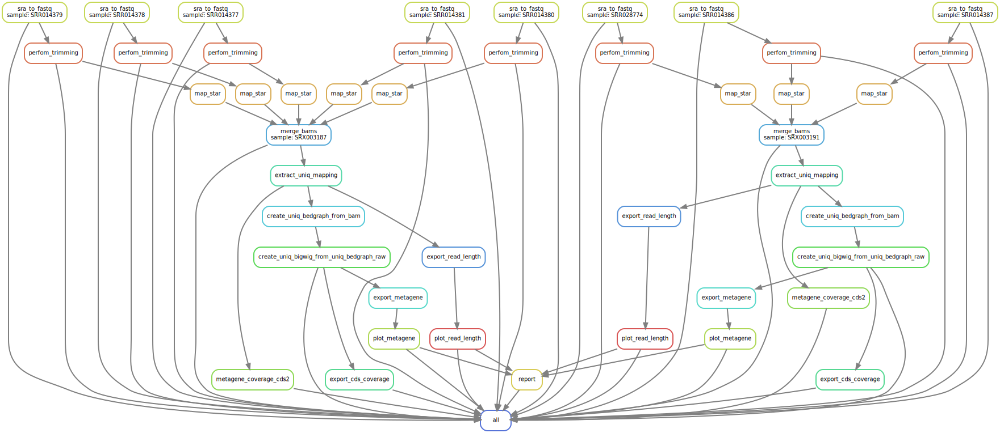

Example Workflow
----------------

.. _`Line4 snakemake/jobscript.sh`: https://github.com/saketkc/riboraptor/blob/47c8a50753c2bcc96b57d43b525a47bb8fde2d04/snakemake/jobscript.sh#L4
.. _`Line6 snakemake/cluster.yaml`: https://github.com/saketkc/riboraptor/blob/47c8a50753c2bcc96b57d43b525a47bb8fde2d04/snakemake/cluster.yaml#L6
.. _`Line7 snakemake/cluster.yaml`: https://github.com/saketkc/riboraptor/blob/47c8a50753c2bcc96b57d43b525a47bb8fde2d04/snakemake/cluster.yaml#L7
.. _`GSE37744`: https://www.ncbi.nlm.nih.gov/geo/query/acc.cgi?acc=GSE37744
.. _`GSE13750`: https://www.ncbi.nlm.nih.gov/geo/query/acc.cgi?acc=GSE13750
.. _`both`: https://www.ncbi.nlm.nih.gov/Traces/study/?acc=SRP000637

We will be working with the first published Ribo-seq dataset `GSE13750`_ from Ingolia et al. (2009) which has samples for `both`_ mRNA-seq and Ribo-seq from **Yeast** grown in starved and nutrient rich media.

At this point, we assume you have already completed all
the steps under "Installing dependencies" section of the README.

Step 1: Downloading datasets
~~~~~~~~~~~~~~~~~~~~~~~~~~~~

We will download all SRA files corresponding to GSE13750.

.. code-block:: bash

   cd riboraptor
   download_sra_data --sradb=../riboraptor-data/SRAmetadb.sqlite \
   --geodb=../riboraptor-data/GEOmetadb.sqlite GSE37744

GEO IDs are automatatiicaly converted to corresponding SRP IDs.
GSE13750 corresponds to SRP000637.

There are 6 experiments in total (SRX003184-SRX003191), but we will be working with only two: `SRX003187`and `SRX003191`
one of which is mRNA-seq while other is Ribo-seq. (We will figure out which is which later.)
You can delete are SRX directories except the above two. We will be using `sacCerR64` as our reference. 

We will now use Snakemake to run all the downstream steps. Here is what the overall workflow looks like:

Step 2: Copy template
~~~~~~~~~~~~~~~~~~~~~~

.. code-block:: bash

   cd snakemake
   cp configs/SRP000637.py.sample configs/SRP000637.py

Edit the paths inside `SRP000637.py` to point to your RAW data, GTF and BED files. BED files for a lot of assemblies are
inbuilt into riboraptor. In most cases, those should suffice. However, you stil need to provide paths to fasta, chromosome sizes and the GTF. The BED files are created from a particular version of the GTF, so if you are using your own GTF, you should ideally be using your own BED files too.

An example of a config would be:

.. code-block:: python

   ## Path to SRP directory
   RAWDATA_DIR = '/staging/as/skchoudh/SRA_datasets/SRP000637'

   ## Output directory (will be created if does not exist)
   OUT_DIR = '/staging/as/skchoudh/riboraptor-analysis/SRP000637'

   ## Genome fasta location
   GENOME_FASTA = '/home/cmb-06/as/skchoudh/genomes/sacCerR64/fasta/Saccharomyces_cerevisiae.R64-1-1.dna.toplevel.fa'

   ## Chromosome sizes location
   CHROM_SIZES = '/home/cmb-06/as/skchoudh/genomes/sacCerR64/fasta/Saccharomyces_cerevisiae.R64-1-1.dna.toplevel.sizes'

   ## Path to STAR index (will be generated if does not exist)
   STAR_INDEX = '/home/cmb-06/as/skchoudh/genomes/sacCerR64/star_annotated'

   ## GTF path
   GTF = '/home/cmb-06/as/skchoudh/genomes/sacCerR64/annotation/Saccharomyces_cerevisiae.R64-1-1.91.gtf'

   ## Path to bed file containing Intron coordinates
   INTRON_BED = '/home/cmb-panasas2/skchoudh/github_projects/riboraptor/riboraptor/annotation/sacCerR64/intron.bed'

   ## Path to bed file containing CDS coordinates
   CDS_BED = '/home/cmb-panasas2/skchoudh/github_projects/riboraptor/riboraptor/annotation/sacCerR64/cds.bed'

   ## Path to bed file containing 5'UTR coordinates
   UTR5_BED = '/home/cmb-panasas2/skchoudh/github_projects/riboraptor/riboraptor/annotation/sacCerR64/utr5.bed'

   ## Path to bed file containing 3'UTR coordinates
   UTR3_BED = '/home/cmb-panasas2/skchoudh/github_projects/riboraptor/riboraptor/annotation/sacCerR64/utr3.bed'

Step 3 : Change your miniconda path
~~~~~~~~~~~~~~~~~~~~~~~~~~~~~~~~~~~

Edit `Line4 snakemake/jobscript.sh`_ pointing to your conda root directory.

   An example path would be:

.. code-block:: bash

   export PATH="/home/cmb-panasas2/wenzhenl/miniconda3/bin:$PATH"

Step 4: Edit snakemake/cluster.yaml
~~~~~~~~~~~~~~~~~~~~~~~~~~~~~~~~~~~

Edit `Line6 snakemake/cluster.yaml`_ and `Line7 snakemake/cluster.yaml`_ to point
to your log directory error log file.

   An example path would be:
   
.. code-block:: yaml

   logout: '/home/cmb-06/as/skchoudh/logs/{rule}.{wildcards}.out'
   logerror: '/home/cmb-06/as/skchoudh/logs/{rule}.{wildcards}.err'

You would want to just edit the directory path leading to `/home/cmb-06/as/skchoudh/logs/` and leave the rest as it is.

Step 5: Submit job
~~~~~~~~~~~~~~~~~~

.. code-block:: bash

   bash submitall.sh SRP000637

The `submitall.sh` looks for a file named `SRP000637.py` in the configs directory, so make sure `SRP000637.py` exists inside
`configs/` directory.

Visualizing Results
~~~~~~~~~~~~~~~~~~~~

When the entire pipeline as run, it will create an html file `riboraptor_report.html` as output. You can copy it locally to visualize metagene profiles and read length distribution for all samples.
